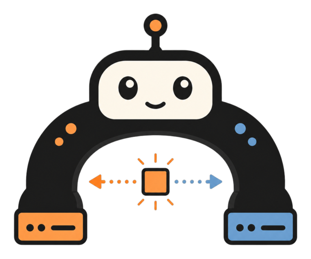
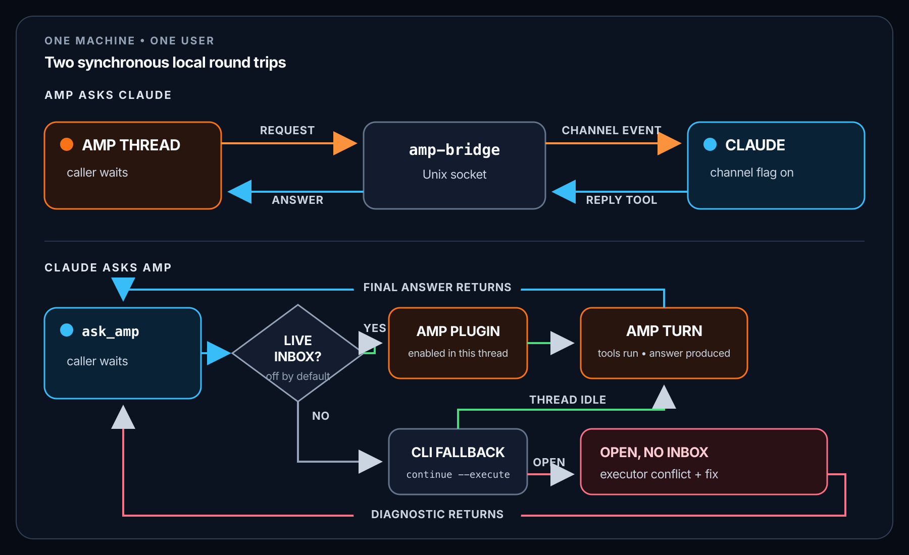

# amp-bridge

<p align="center">
  
</p>

<p align="center"><strong>Let an Amp thread and a live Claude Code session talk directly on your machine.</strong></p>

```text
Amp thread  ◀──── Unix socket ────▶  amp-bridge  ◀──── Claude channel ────▶  Claude Code
```

No copy-paste relay. No additional server, API key, or network hop. The bridge is
a small, dependency-free Go binary using a per-user Unix socket and local
registry under `/tmp`.

It registers as a Claude Code [channel](https://code.claude.com/docs/en/channels-reference):
an MCP server allowed to push an event into a running session and receive a
correlated reply.

> **Status:** experimental and last live-tested against Claude Code `2.1.246`
> on 2026-08-26.
> Custom channels still require a development launch flag, and their contract
> may change between Claude Code releases. `amp-bridge doctor` detects the
> breakages that otherwise fail silently.

## Quick start

The complete machine-wide setup is four commands:

```bash
curl -fsSL https://raw.githubusercontent.com/oliver-kriska/amp-claude/main/install.sh | sh
export PATH="$HOME/.local/bin:$PATH"
amp-bridge init --global               # Claude channel + skill
amp-bridge init --amp-plugin --global  # Amp inbox for the return direction
```

The export makes the installed binary available immediately. If the installer
reports that `~/.local/bin` was not already on `PATH`, add the same export to
your shell profile so future shells find it too.

Then start the Claude Code session you want Amp to reach:

```bash
cd ~/Projects/my-app
claude --name my-app-review \
  --dangerously-load-development-channels server:amp-bridge
```

The flag is required for every Claude session that should receive bridge events;
it does not loosen either agent's tool permissions.

Test Amp → Claude from any shell:

```bash
amp-bridge --ask "Reply with exactly PONG"
```

`PONG` means the full request/reply path works. If it fails, run
`amp-bridge doctor`; every failing check prints its own fix.

That is all you need for **Amp → Claude**. To let Claude ask an Amp thread you
have open, enable that thread's inbox once:

```text
Ctrl+O → amp-bridge: Enable Claude inbox for this thread
```

If Amp was already open when you installed the plugin, run `Ctrl+O` →
`plugins: reload` first. A fresh Amp process has no thread until you send its
first message.

→ **[Getting started](docs/getting-started.md)** walks the first real two-way
exchange end to end, including managed threads and what each `init` scope
actually changes.

## In daily use

Once the pair is established, normal use is two plain-language prompts:

```text
you → Amp:     Use amp-bridge to ask Claude session my-app-review to review auth.go.
you → Claude:  Ask Amp whether the running app reproduced the race.
```

You do not handle sockets, request ids or bridge protocol.

## Three parts, three jobs

Keeping these apart is most of the mental model.

| Part | What it does | What it does not do |
|---|---|---|
| Claude channel | Carries Amp's request into a running Claude session and correlates its reply | Does not teach Claude when to use the bridge |
| Claude skill | Teaches Claude to answer with `reply`, consult with `ask_amp`, or delegate with `send_amp` | Is not a transport and does not enable an Amp inbox |
| Amp inbox plugin | Appends Claude's request through the executor that already owns an open thread and captures its eventual answer | Cannot wake an idle Amp thread; Amp must start the queued turn |

You do not invoke the skill yourself. Claude loads it when an amp-bridge event
arrives or when you ask Claude to "ask Amp".

## How it works

Amp → Claude is a synchronous request/reply. Claude → Amp offers both shapes:
`ask_amp` waits for Amp's answer, while `send_amp` returns a handle and delivers
the result later as a channel completion event. Both are local and in-memory;
neither is a durable message queue.

<p align="center">
  
</p>

The plugin path in the diagram is delivery, not a wake primitive. A request to
an idle open thread waits until Amp starts another turn; the bridge reports that
state rather than pretending background work began.

The inbox check happens before the CLI fallback. An open thread without an
enabled inbox therefore reaches the fallback and is refused because Amp will
not attach a second executor. The error identifies the owning process and tells
you how to enable the inbox.

### Which threads each direction can reach

Amp permits **one executor per thread**. An interactive `amp` session sitting in
a thread holds that slot, which is why an inbox exists at all.

| Thread state | Amp → Claude | Claude → Amp |
|---|---|---|
| Nobody has it open | `amp-bridge --ask` ✓ | `ask_amp` / `send_amp` ✓ — via the CLI |
| Open, inbox enabled and Amp starts the queued turn | `amp-bridge --ask` ✓ | `ask_amp` / `send_amp` ✓ — via the plugin |
| Open, inbox enabled but idle | `amp-bridge --ask` ✓ | Request is queued, but no automatic turn; caller gets `no-turn`, and later activity may pick it up |
| Open, no inbox | `amp-bridge --ask` ✓ | `ask_amp` / `send_amp` ✗ |

→ [Reaching a thread you have open](docs/getting-started.md#reaching-a-thread-you-have-open)

## Five rules worth knowing before you rely on it

1. **The launch flag is per session.** There is no config-file equivalent, and a
   running Claude session cannot acquire the channel later. Restart it.
2. **An enabled inbox grants addressability, not wake-up.** Claude can reach a
   thread you have open; it cannot start a turn in one sitting idle. Someone has
   to give that thread activity. Do not treat an open idle thread as an
   unattended background worker.
3. **Never resend after `no-turn` or a delivered timeout.** The request is
   already in the thread. A `send_amp` completion says which case it was:
   `pending` means delivered and still running, `not-delivered` means nothing was
   appended and a retry is safe, `unknown` means the bridge could not tell.
4. **A completed Amp turn that emits no text is reported as `produced no
   answer`, never as a blank success.** The turn ran, so inspect the thread and
   rephrase rather than resending verbatim.
5. **It is not a durable queue and not a permission bypass.** Nothing is
   persisted or retried; an MCP restart loses outstanding completions. Both
   agents run as you, and both sides are told to refuse work the other was
   denied.

## Why bridge them?

Two coding agents on one machine usually leave you copy-pasting between two
terminals. The bridge removes you from the middle.

**A second opinion from the session that has the context.** You are working in
Amp; a Claude session is open on the same repo and has been living in it all
afternoon. Ask it directly instead of re-explaining. The first real use of this
bridge was exactly that — Amp code-reviewed this repository through it, and the
findings are in the git history.

**Cross-project questions.** Sessions register machine-wide, so Amp in one repo
can ask a Claude session sitting in another. `amp-bridge --list` names them;
`--session` picks one. The answer comes from the project that session has open.

**Claude hands work to Amp.** `ask_amp` and `send_amp` request a full turn in an
Amp thread: Amp's model, Amp's tools, that thread's workspace. `ask_amp` blocks
until the turn ends (up to two minutes); `send_amp` returns immediately and
brings the result back later as a completion event.

**Not only Amp.** `amp-bridge --ask` is a plain binary that blocks and prints, so
anything that can run a process can query a live session — including a stray
tmux pane.

## Requirements

- **macOS or Linux.** The transport is a Unix socket; there is no Windows support.
- **[Claude Code](https://claude.com/claude-code)** — last verified against
  `2.1.246` on 2026-08-26. `amp-bridge doctor` catches protocol drift that would
  otherwise fail silently.
- **The [Amp CLI](https://ampcode.com) on PATH** — needed only for the
  Claude→Amp direction (`ask_amp` and `send_amp`). Everything inbound works
  without it.
- **Both agents on the same machine.** A remote Amp worker cannot reach a local
  socket.

## Installing

The quick start uses the **prebuilt binary** for macOS or Linux, amd64 or arm64.
The install script verifies the download's SHA-256 against the published
checksums before installing to `~/.local/bin`; it is short enough to read first
if you would rather not pipe to a shell. `AMP_BRIDGE_PREFIX=/usr/local` overrides
the destination and `AMP_BRIDGE_VERSION=v0.2.0` pins a release.

Release archives carry signed build provenance:

```bash
gh attestation verify amp-bridge_*.tar.gz -R oliver-kriska/amp-claude
```

**With Go** (1.27+):

```bash
go install github.com/oliver-kriska/amp-claude/amp-bridge@latest
```

**From source:**

```bash
git clone https://github.com/oliver-kriska/amp-claude
cd amp-claude
mise install       # optional: pins Go + golangci-lint from .tool-versions
make setup-global  # build, install, and set up both directions machine-wide
```

To check an install, run `amp-bridge doctor`. It executes the configured binary
rather than trusting the config, and compares every live session's build
fingerprint against the installed one — which catches the failure with no
symptom, where everything reports healthy and nothing is delivered.

→ [Registration scopes, aliases and verification](docs/getting-started.md#register-it)
· [Configuration and uninstall](docs/operations.md)

## Development

```bash
make check                # the gate: tidy, drift gates, format, vet, lint, both test tiers under -race
make test                 # fast unit pass
make test-integration     # spawns a real bridge process and drives both ends
make help                 # every target
```

Neither test tier needs the network or a live Claude session. A rebuild does not
change what a running session is executing — that is what `doctor`'s fingerprint
check reports.

**The module has no dependencies and must not gain one.** Every MCP SDK
implements `server/discover`, which wins the modern handshake negotiation and
silently kills channel delivery.

→ [Development guide](docs/development.md), including the three protocol
decisions that look like bugs and are load-bearing.

## Documentation

- [Getting started](docs/getting-started.md) — registration, the first two-way
  exchange, pairing, inboxes, and what each scope changes
- [Operations](docs/operations.md) — scopes, configuration, security, uninstall,
  and the questions people actually ask
- [Development](docs/development.md) — building, testing, and the protocol
  invariants
- [`AGENTS.md`](AGENTS.md) — how Amp should drive the bridge
- [`.claude/skills/amp-bridge/SKILL.md`](.claude/skills/amp-bridge/SKILL.md) — how Claude should

## Licence

MIT © Oliver Kriska
